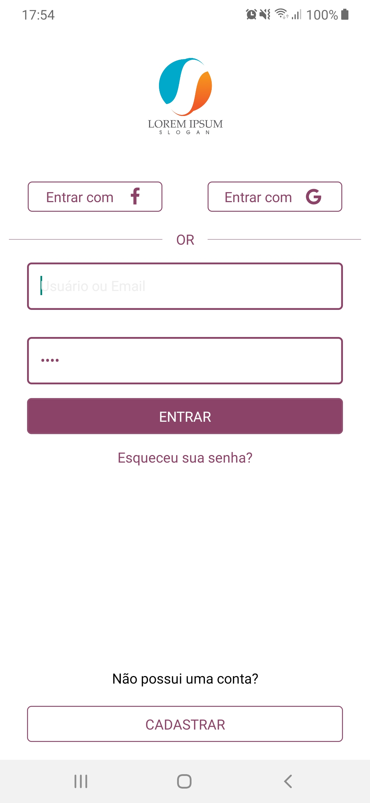
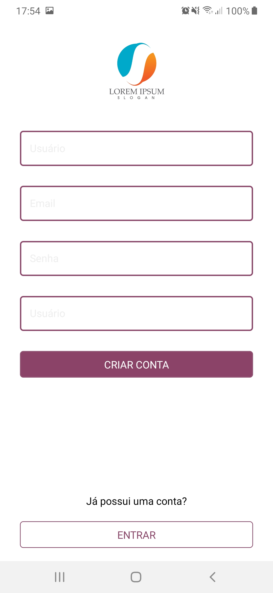

  <h1 align="center"> React-Native - Login Page </h1>
  
 React-Native 

  
  

# :muscle: Login Page
Basic Login Page
 
# :computer: React-Native

## Description:
* Static login and register screens

## :video_camera: Tecnologies:
* React-Native: "0.61.5"
* React-Navigation: "^5.0.4"
* React-Vector-Icon: "^6.6.0" 

## References 

* Logo: <a href="https://www.vecteezy.com/"> Vectors by Vecteezy</a>

## PrintScreens

